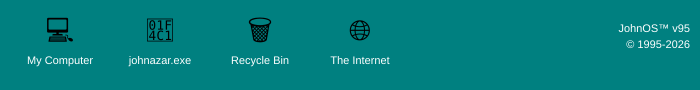
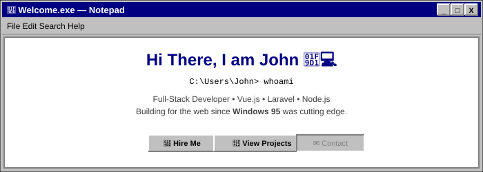
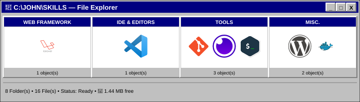
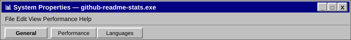
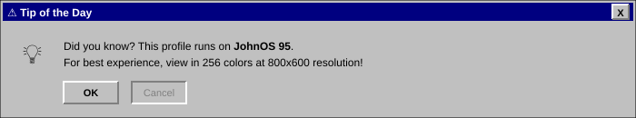
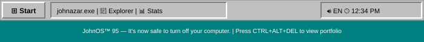

 
 
 
 

<table align="center"><tr>
<td align="center"></td>
<td align="center"></td>
</tr></table>

 
 

<!--
**johnazar/johnazar** is a ✨ _special_ ✨ repository because its `README.md` (this file) appears on your GitHub profile.
-->
