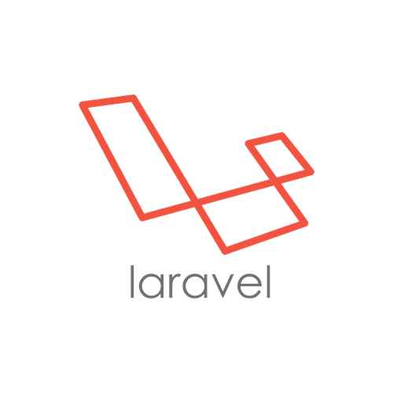

<table align="center" style="width:100%; max-width:700px;" cellspacing="0" cellpadding="0">
<tr><td align="left" style="color:#FFFFFF; font-family:'MS Sans Serif',Tahoma,sans-serif; font-size:11px; padding:0 0 12px 4px;">
💻 My Computer
📁 johnazar.exe
🗑️ Recycle Bin
🌐 The Internet
</td><td align="right" style="color:#FFFFFF; font-size:11px; font-family:'MS Sans Serif',Tahoma,sans-serif;">JohnOS™ v95 © 1995-2026</td></tr>
</table>

<table align="center" style="width:100%; max-width:700px; background-color:#C0C0C0; border:2px solid #000; border-top-color:#DFDFDF; border-left-color:#DFDFDF; border-right-color:#808080; border-bottom-color:#808080;" cellspacing="0" cellpadding="0">
<tr><td style="background-color:#000080; padding:3px 4px;">
<table width="100%" cellspacing="0" cellpadding="0"><tr>
<td style="color:#FFFFFF; font-family:'MS Sans Serif',Tahoma,sans-serif; font-size:12px; font-weight:bold;">📝 Welcome.exe — Notepad</td>
<td align="right">
_
□
X
</td></tr></table>
</td></tr>
<tr><td style="padding:2px;">
<table width="100%" cellspacing="0" cellpadding="0" style="background:#C0C0C0;">
<tr><td style="padding:2px 6px; font-family:'MS Sans Serif',Tahoma,sans-serif; font-size:11px; color:#000; border-bottom:1px solid #808080;"><u>F</u>ile &nbsp; <u>E</u>dit &nbsp; <u>S</u>earch &nbsp; <u>H</u>elp</td></tr>
<tr><td style="background:#FFFFFF; border:2px solid; border-color:#808080 #FFFFFF #FFFFFF #808080; padding:18px 14px; text-align:center;">

Hi There, I am John :technologist:

C:\Users\John&gt; whoami

Full-Stack Developer • Vue.js • Laravel • Node.js Building for the web since <b>Windows 95</b> was cutting edge.

💾 Hire Me
📂 View Projects
✉️ Contact

</td></tr>
</table>
</td></tr>
</table>

 

<table align="center" style="width:100%; max-width:700px; background:#C0C0C0; border:2px solid #000; border-top-color:#DFDFDF; border-left-color:#DFDFDF; border-right-color:#808080; border-bottom-color:#808080;" cellspacing="0" cellpadding="0">
<tr><td style="background:#000080; padding:3px 4px;">
<table width="100%" cellspacing="0" cellpadding="0"><tr>
<td style="color:#FFF; font-family:'MS Sans Serif',Tahoma,sans-serif; font-size:12px; font-weight:bold;">📁 C:\JOHN\SKILLS — File Explorer</td>
<td align="right">_□X</td></tr></table>
</td></tr>
<tr><td style="padding:2px;">
<table width="100%" cellspacing="0" cellpadding="0" style="background:#C0C0C0;">
<tr>
<td width="25%" style="background:#C0C0C0; border:2px solid; border-color:#FFF #808080 #808080 #FFF; padding:0;" align="center" valign="top">
WEB FRAMEWORK

1 object(s)
</td>
<td width="25%" style="background:#C0C0C0; border:2px solid; border-color:#FFF #808080 #808080 #FFF; padding:0;" align="center" valign="top">
IDE & EDITORS

1 object(s)
</td>
<td width="25%" style="background:#C0C0C0; border:2px solid; border-color:#FFF #808080 #808080 #FFF; padding:0;" align="center" valign="top">
TOOLS

  

3 object(s)
</td>
<td width="25%" style="background:#C0C0C0; border:2px solid; border-color:#FFF #808080 #808080 #FFF; padding:0;" align="center" valign="top">
MISC.

 

2 object(s)
</td>
</tr>
</table>

8 Folder(s) • 16 File(s) • Status: Ready • 💾 1.44 MB free

</td></tr>
</table>
</td></tr>
</table>

 

<table align="center" style="width:100%; max-width:700px; background:#C0C0C0; border:2px solid #000; border-top-color:#DFDFDF; border-left-color:#DFDFDF; border-right-color:#808080; border-bottom-color:#808080;" cellspacing="0" cellpadding="0">
<tr><td style="background:#000080; padding:3px 4px;">
<table width="100%" cellspacing="0" cellpadding="0"><tr>
<td style="color:#FFF; font-family:'MS Sans Serif',Tahoma,sans-serif; font-size:12px; font-weight:bold;">📊 System Properties — github-readme-stats.exe</td>
<td align="right">_□X</td></tr></table>
</td></tr>
<tr><td style="padding:2px;">
<table width="100%" cellspacing="0" cellpadding="0" style="background:#C0C0C0;">
<tr><td style="padding:2px 6px; font-family:'MS Sans Serif',Tahoma,sans-serif; font-size:11px; color:#000; border-bottom:1px solid #808080;"><u>F</u>ile &nbsp; <u>E</u>dit &nbsp; <u>V</u>iew &nbsp; <u>P</u>erformance &nbsp; <u>H</u>elp</td></tr>
<tr><td style="padding:10px; text-align:center;">

General
Performance
Languages

<table align="center" cellspacing="8" cellpadding="0"><tr>
<td align="center" style="background:#FFF; border:2px solid; border-color:#808080 #FFF #FFF #808080; padding:8px;"></td>
<td align="center" style="background:#FFF; border:2px solid; border-color:#808080 #FFF #FFF #808080; padding:8px;"></td>
</tr></table>

💾 If you forked this repo, change <code style="background:#FFF; border:1px solid #808080; padding:0 4px; font-family:'Courier New',monospace;">username=johnazar</code> to yours!

</td></tr>
</table>
</td></tr>
</table>

<table align="center" style="width:100%; max-width:420px; background:#C0C0C0; border:2px solid #000; border-top-color:#DFDFDF; border-left-color:#DFDFDF; border-right-color:#808080; border-bottom-color:#808080;" cellspacing="0" cellpadding="0">
<tr><td style="background:#000080; padding:3px 4px; color:#FFF; font-family:'MS Sans Serif',Tahoma,sans-serif; font-size:11px; font-weight:bold;">⚠️ Tip of the Day X</td></tr>
<tr><td style="padding:12px; font-family:'MS Sans Serif',Tahoma,sans-serif; font-size:11px; color:#000;">
<table cellspacing="0" cellpadding="0"><tr>
<td valign="top" style="font-size:28px; padding-right:10px;">💡</td>
<td style="font-size:11px; line-height:1.4; color:#000; font-family:'MS Sans Serif',Tahoma,sans-serif;">Did you know? This profile runs on <b>JohnOS 95</b>. For best experience, view in 256 colors at 800x600 resolution!  OK &nbsp; Cancel</td>
</tr></table>
</td></tr>
</table>

 

 

<table align="center" style="width:100%; max-width:700px; background:#C0C0C0; border:2px solid; border-color:#DFDFDF #808080 #808080 #DFDFDF;" cellspacing="0" cellpadding="3">
<tr>
<td style="font-family:'MS Sans Serif',Tahoma,sans-serif; font-size:11px;" valign="middle">
⊞ Start
johnazar.exe &nbsp;|&nbsp; 📁 Explorer &nbsp;|&nbsp; 📊 Stats
</td>
<td align="right" style="font-size:11px; color:#000; font-family:'MS Sans Serif',Tahoma,sans-serif;" valign="middle">
🔊 &nbsp; EN &nbsp; 🕒 12:34 PM
</td>
</tr>
</table>

JohnOS™ 95 — It's now safe to turn off your computer. &nbsp;|&nbsp; Press CTRL+ALT+DEL to view portfolio

<!--
**johnazar/johnazar** is a ✨ _special_ ✨ repository because its `README.md` (this file) appears on your GitHub profile.
-->

