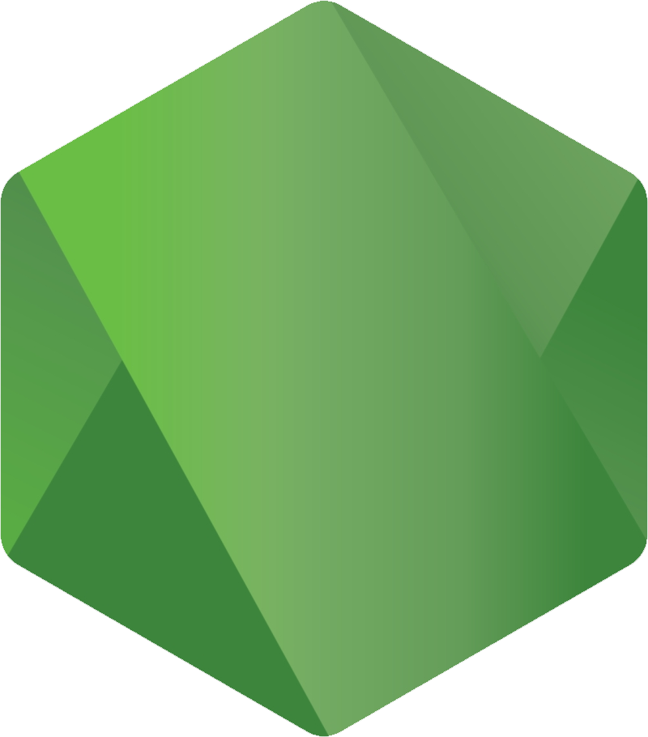

# 💻 Hey There, I am John 💻

  <table align ="center">
    <thead>
    <tr>
      <th>Languages</th>
      <th>Databases</th>
      <th>Frameworks</th>
      <th>Web</th>
    </tr>
    </thead>
    <tbody>
      <tr>
        <td align = "center">
          
          
        </td>
        <td  align = "center">
          
        </td>
        <td  align = "center">
          
        </td>
        <td align = "center">
          
          
          
        </td>
      </tr>
    </tbody>
    <thead>
    <tr>
      <th>IDEs</th>
      <th>Text Editors</th>
      <th>Tools</th>
      <th>Misc.</th>
    </tr>
    </thead>
    <tbody>
      <tr>
        <td align = "center">
          
        </td>
        <td align = "center">
          
          
          
        </td>
        <td  align = "center">
          
          
        </td>
        <td  align = "center">
          
        </td>
      </tr>
    </tbody>
  </table>

<!--
**johnazar/johnazar** is a ✨ _special_ ✨ repository because its `README.md` (this file) appears on your GitHub profile.

Here are some ideas to get you started:

- 🔭 I’m currently working on ...
- 🌱 I’m currently learning ...
- 👯 I’m looking to collaborate on ...
- 🤔 I’m looking for help with ...
- 💬 Ask me about ...
- 📫 How to reach me: ...
- 😄 Pronouns: ...
- ⚡ Fun fact: ...
-->
